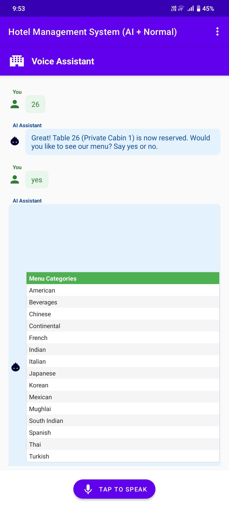

# 🤖 AI-Powered Hotel Management System

---

---

## 📱 Overview

The **AI-Powered Hotel Management System** is a dual-application Android solution designed to modernize the traditional hotel experience. It consists of:

- A **User App** that supports:

  - Normal table/menu ordering system
  - AI-powered **Text-based Assistant**
  - AI-powered **Voice-based Assistant**

- An **Admin App** for:
  - Table status management
  - Live order tracking and status updates

All data is managed in real-time with **Firebase**, and AI experiences are powered by **Google Vertex AI**.

---

## 🚀 Features

### 👤 User App

- Firebase Authentication
- Three Ordering Modes:
  - ✅ Traditional
  - 💬 AI Text Assistant
  - 🎙️ AI Voice Assistant
- Real-time Menu & Table Availability
- Dynamic Order Summary & Status
- View & Cancel Orders
- Voice interaction using Vertex AI

### 🔧 Admin App

- Admin Login
- Table Occupancy Management (Green/Red Status)
- Real-time Order Monitoring
- Update Order Status: Pending → In Progress → Served → Cancelled

---

## 🧠 System Flow

### 🔹 Normal Hotel Management System

1. **Login / Signup**
2. **Select Table**
3. **Choose Category & Items**
4. **Place Order or Clear Menu**
5. **Receive Confirmation**  
   ✔️ _“Thank you! Your order has been placed successfully…”_

---

### 💬 AI Text Hotel Management

Conversational AI Guides the User:

- `Hello! How may I assist you today?`
- Select table → Category → Item → Quantity
- Confirm order after full summary

Example:
`Would you like to place this order? (yes/no)`

---

### 🎙️ AI Voice Hotel Management

- Voice interactions via mic button
- Speak actions like:
  - “Book a table”
  - “Show Chinese menu”
  - “Order 2 Chow Mein”
- Real-time voice-to-action with dynamic UI feedback

---

### 🛠️ Admin Dashboard

- Authenticate with Admin credentials
- View & change table statuses (Red = Occupied, Green = Available)
- Monitor orders placed by all users
- Change Order Status dynamically

**Note:**  
Users can cancel only **pending** orders.  
If status is “In Progress” or beyond:
`“Sorry, you can't cancel this order now. Please visit the reception.”`

---

## 🔗 Technologies Used

| Technology       | Purpose                           |
| ---------------- | --------------------------------- |
| Java             | Core App Development              |
| Android Studio   | Development Environment           |
| XML              | UI Design                         |
| Firebase Auth    | User Authentication               |
| Firebase RTDB    | Real-time Database (Menu, Orders) |
| Firebase Storage | Asset Storage (optional)          |
| Vertex AI        | AI Text + Voice Assistant Backend |
| Gradle           | Build Automation                  |

---

## 📸 Screenshot Gallery

### 👤 User App

**🔐 Authentication & Welcome**

|  |  |
| :----------------------------------------------------------------------: | :---------------------------------------------------------------: |

**🪑 Table Selection & 🧾 Category/Item Selection**

|  |  |
| :------------------------------------------------------------: | :--------------------------------------------------------------------------------: |

**✅ Order Success & 📋 View Orders**

|  |  |
| :--------------------------------------------------------: | :---------------------------------------------------------: |

**❌ Cancel Order Option & 💬 AI Text Mode Home**

|  |  |
| :--------------------------------------------------------------------: | :-------------------------------------------------------------: |

---

### 💬 AI Text-Based System

**🪑 Select Table & 📋 Choose Category**

|  |  |
| :------------------------------------------------------------------------------: | :-------------------------------------------------------------------------------------: |

**🍜 Select Items & 🧾 Order Summary**

|  |  |
| :-----------------------------------------------------------------------------: | :---------------------------------------------------------------------------: |

**✅ Post Order Message & 🎙️ Switch to Voice Mode**

|  |  |
| :-----------------------------------------------------------------------------: | :------------------------------------------------------------------------------------: |

---

### 🎙️ AI Voice-Based System

**📋 Choose Category & 🍲 Select Item**

|  |  |
| :---------------------------------------------------------------------------------------: | :-------------------------------------------------------------------------------: |

**🔢 Choose Quantity & 🧾 Summary**

|  |  |
| :---------------------------------------------------------------------------------------: | :-----------------------------------------------------------------------------: |

**✅ Post Order Message and show Orders after Placing**

|  |  |
| :--------------------------------------------------------------------------: | :---------------------------------------------------------------------------------: |

---

### 🔧 Admin App

**🔐 Admin Home & 🟩 Table Management**

|  |  |
| :--------------------------------------------------------: | :---------------------------------------------------------: |

**🟥 Update Table Status & 🗂️ Table Overview**

|  |  |
| :---------------------------------------------------------------------: | :---------------------------------------------------: |

**📋 View Orders & ✏️ Update Order Status**

|  |  |
| :--------------------------------------------------------------: | :---------------------------------------------------------------------: |

**📈 Orders After Update & Extra Orders**

|  |  |
| :---------------------------------------------------------------------: | :-------------------------------------------------------------------: |

|  |  |
| :-------------------------------------------------------------------: | :-------------------------------------------------------------------: |

---

## 📄 License

This project is licensed under the [MIT License](./LICENSE).

---

## 🙌 Acknowledgements

- Google Firebase for Realtime DB & Auth
- Google Vertex AI for conversational and voice AI
- Android Developers for robust development tools
- Your dedication to building a futuristic hotel solution! 🚀

---
